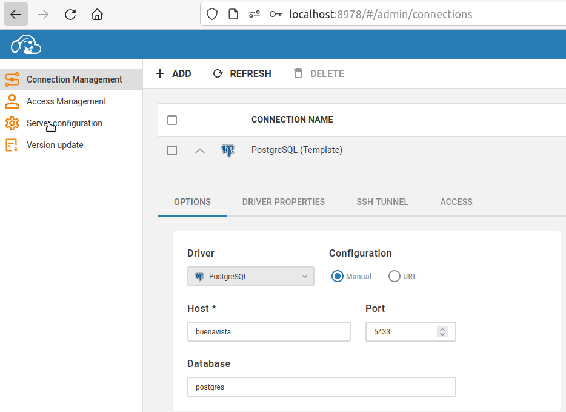

# Connecting to buenavista proxy using containers

## Using psql to connect to buenavista proxy with in-memory duckdb database

To start a buenavista proxy server providing access to a duckdb in-memory db, while using the postgres wire format, try this example command (it exposes the service at port 8080):

		docker run -it --rm -p 8080:5433 -e BUENAVISTA_HOST=0.0.0.0 -e BUENAVISTA_PORT=5433 -v $(pwd)/data:/data ghcr.io/jwills/buenavista

Once buenavista has started, a client with network access to the service, such as `psql`, can be used to connect. Example which runs a query using psql against the service above: 

		docker run --network host -it --rm postgres:latest psql -h $(hostname) -p 8080 -c "select 42"
		
To get an interactive psql shell, use for example:

		docker run --network host -it --rm postgres:latest psql -h $(hostname) -p 8080

### Using duckdb to read parquet and sqlite3 formats

First download some example data using the `download_data.sh` script:

		# put example data files in the ./data directory first
		./download_data.sh

		# this command mounts the data directory inside the container's /data directory
		docker run -it --rm -p 8080:5433 -e BUENAVISTA_HOST=0.0.0.0 -e BUENAVISTA_PORT=5433 -v $(pwd)/data:/data ghcr.io/jwills/buenavista

		# start the psql shell
		docker run --network host -it --rm postgres:latest psql -h $(hostname) -p 8080

In the psql shell, commands that use duckdb's parquet and sqlite scanners can be used:
		
		# example of statements to try in the psql shell
		
		install 'parquet';
		install 'sqlite';
		load 'parquet';
		load 'sqlite';
		
		select * from parquet_scan('/data/iris.parquet');
		
		call sqlite_attach('/data/chinook.db');
		show tables;	

## Local build 

To build a container image and use the services locally, clone the repo, and use the Makefile target "build" when in the docker directory:

		make build

## Usage from cloudbeaver web UI

To start services use the `docker-compose.yml` file with podman-compose or docker-compose:

		docker-compose up -d

Then navigate to http://localhost:8978 (cloudbeaver GUI)

When setting up a connection, use the Postgres Template and point it to:

host: buenavista
port: 5433

This corresponds to the internal name and port for the buenavista service inside the container's SDN.

### Screenshot

